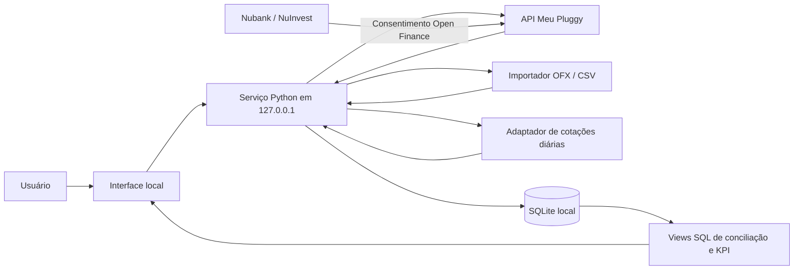

# Aplicação pessoal de finanças e investimentos — especificação de design

**Status:** desenho aprovado pelo usuário em 22/09/2026  
**Escopo:** aplicação de uso individual, executada localmente no Windows

## 1. Objetivo e critérios de sucesso

Consolidar dados da conta Nubank/NuInvest e da carteira de investimentos em uma aplicação local, manter o histórico em SQLite e calcular a valorização e os KPIs no próprio banco. A estrutura deve permitir acrescentar novas instituições e classes de ativos sem refazer o núcleo.

O MVP terá sucesso quando:

1. importar os dados disponibilizados da conta Nubank/NuInvest;
2. gravar saldos, movimentações, investimentos, posições e cotações no SQLite com origem e data de referência;
3. aceitar nova sincronização sem duplicar operações;
4. calcular valor de mercado e KPIs no SQLite a partir das posições e dos fechamentos diários;
5. sinalizar posição divergente, cotação ausente ou antiga e sincronização incompleta;
6. fazer backup e restauração da base local.

## 2. Decisões de escopo

- O aplicativo, a interface e o arquivo SQLite permanecem nesta máquina. Não haverá hospedagem, sincronização da base em nuvem ou publicação no GitHub.
- O backend local será escrito em Python e acessado por uma interface no navegador ligada somente a `127.0.0.1`.
- O SQLite será a fonte central dos dados normalizados, do histórico de preços e dos cálculos de conciliação e KPI.
- A conexão bancária inicial será Nubank/NuInvest via Meu Pluggy, com consentimento do titular no fluxo do Open Finance. A documentação atual do Meu Pluggy descreve uso pessoal gratuito, até cinco conexões e atualização a cada 24 horas. O serviço externo participa do fluxo e mantém a conexão; portanto, “local” se refere ao aplicativo e à base de dados, não à ausência de provedores externos.
- O MVP usará cotações de fechamento diário. A fonte de preços será escolhida na etapa de viabilidade segundo cobertura dos ativos, histórico, custo e termos de uso. Se não houver fonte automatizada adequada, o modelo permitirá importar preços por arquivo.
- A documentação da B3 não oferece acesso direto às APIs da Área do Investidor para pessoas físicas; essas APIs são destinadas a clientes B2B. Para o MVP, primeiro será verificado o que o conector Nubank/NuInvest compartilha via Open Finance. A API da B3 fica como opção futura condicionada a acesso B2B; importação de arquivos continua como alternativa.
- O escopo inicial de investimentos são ações, FIIs, BDRs e ETFs negociados na B3 quando presentes nos dados autorizados. Outras classes podem ser acrescentadas depois.
- Os KPIs de custo médio e lucro/prejuízo não realizado só serão apresentados quando houver base de custo suficientemente completa. Se faltarem operações antigas, o sistema marcará o resultado como indisponível ou usará uma posição de abertura informada/importada, sem inventar histórico.

## 3. Arquitetura e fluxo de dados

O consentimento será feito pelo fluxo do Meu Pluggy e do Nubank. A aplicação local consultará a API quando o usuário pedir sincronização ou quando a rotina diária local executar. O MVP não dependerá de webhook de entrada, que exigiria um endpoint público.

Cada coleta será registrada como uma execução de sincronização com fonte, horários, estado, data da última atualização externa e contagens de registros. Os adaptadores traduzirão as respostas de cada origem para o modelo comum. As regras financeiras ficarão em consultas e views SQL, não em cálculos independentes na interface.

Os extratos mensais Nubank em OFX poderão servir para carga inicial e contingência. O acesso automatizado usará o fluxo autorizado de Open Finance, sem coleta de senha do banco ou scraping da interface do Nubank.

## 4. Modelo de dados

O esquema inicial terá estas entidades conceituais:

| Entidade | Conteúdo principal |
|---|---|
| `sync_run` | fonte, início/fim, estado, data externa de atualização, contagens e erro resumido |
| `financial_account` | instituição, conta/produto, identificador externo e moeda |
| `account_balance_snapshot` | saldo informado, conta, origem e data de referência |
| `cash_transaction` | identificador externo, conta, datas, descrição, valor assinado e origem |
| `instrument` | ticker, identificador de mercado/ISIN quando disponível, classe e moeda |
| `investment_event` | compra, venda, provento, taxa ou evento corporativo, ativo, quantidade, valor e data |
| `position_snapshot` | quantidade por ativo e conta/origem numa data de referência |
| `daily_quote` | ativo, data de pregão, fechamento, moeda, fornecedor e data de importação |
| `reconciliation_note` | decisão manual do usuário sobre uma pendência, sem alterar o registro original |

Registros importados manterão o identificador da origem, a data de referência, a data de recebimento e a execução de sincronização que os trouxe. A unicidade por origem e identificador externo, ou uma impressão digital determinística para arquivo sem identificador, impedirá duplicações.

Valores monetários serão armazenados em centavos inteiros; quantidades usarão uma representação inteira de precisão fixa. O esquema terá migrações versionadas e chaves estrangeiras ativadas.

## 5. Regras de conciliação e KPIs

As conciliações serão executadas no SQLite por views SQL:

1. **Saldo bancário:** comparar o saldo importado com o saldo de abertura mais entradas e saídas registradas.
2. **Posição de investimentos:** comparar a quantidade reconstruída a partir da posição de abertura, compras, vendas e eventos corporativos com a quantidade do snapshot mais recente.
3. **Valorização:** multiplicar a quantidade da posição pelo último fechamento disponível na data de referência. Exibir fonte e data do preço; cotação ausente ou antiga gera alerta.
4. **Custo e resultado:** calcular custo médio e lucro/prejuízo não realizado quando o histórico de operações e eventos for suficiente. A posição inicial pode ser carregada como abertura se o histórico anterior não estiver disponível.

KPIs do MVP: valor de mercado por ativo e da carteira; custo médio quando confiável; lucro/prejuízo não realizado quando confiável; variação de preço diária; e saldo bancário. A variação diária será identificada como variação de preço, sem ser apresentada como rentabilidade total ajustada por aportes e proventos. Rentabilidade total e apuração fiscal ficam fora do MVP.

Uma diferença de quantidade não será corrigida automaticamente. Ela aparecerá como pendência com fonte, data, quantidade importada e quantidade calculada. Compras e vendas inferidas apenas de movimentações bancárias não serão criadas automaticamente.

## 6. Falhas, privacidade e operação local

- Falha ou resposta parcial preserva os dados válidos anteriores. Uma posição só será tratada como snapshot completo quando a origem confirmar que a coleta terminou.
- Sincronizações serão idempotentes. Falhas, dados parciais, preços ausentes e pendências de conciliação serão visíveis na interface.
- A aplicação continuará mostrando os últimos dados locais quando estiver sem internet, indicando a data da última sincronização.
- Segredos de API ficarão no Windows Credential Manager, nunca no código, no SQLite ou na interface enviada ao navegador. Senhas bancárias não serão solicitadas nem armazenadas.
- A interface ficará vinculada a `127.0.0.1`; não haverá porta pública ou serviço acessível pela rede local.
- O arquivo SQLite ficará no perfil local do usuário, separado do código. Backups serão locais e terão procedimento de restauração documentado.
- A aplicação usará apenas os dados necessários e guardará proveniência suficiente para auditoria; não é necessário conservar cópias integrais de respostas com dados pessoais quando os campos normalizados bastarem.

## 7. Etapas de implementação

1. **Viabilidade de dados:** usuário conecta Nubank/NuInvest no Meu Pluggy; confirmar quais recursos, investimentos, operações e histórico são retornados; selecionar fonte de fechamento diário e validar seus termos.
2. **Núcleo local:** criar aplicação local, migrações SQLite, execução de sincronização e importador OFX/CSV para carga inicial e contingência.
3. **Conector Nubank:** ler dados disponíveis pela API do Meu Pluggy, normalizar e persistir saldos, movimentações e investimentos.
4. **Preços e SQL:** carregar fechamentos diários e criar views de valorização, KPI e conciliação.
5. **Painel e operação:** exibir posições, valores, datas de atualização, cotações antigas e diferenças; documentar backup e restauração.
6. **Extensões futuras:** outros bancos/corretoras, mais classes de ativos, rentabilidade total com proventos e eventual integração B2B da B3 se houver acesso elegível.

## 8. Limites e verificações antes do cálculo financeiro

- A tabela de cobertura do agregador indica suporte do conector Nubank a classes de investimento, mas os recursos efetivamente liberados dependem do consentimento e dos dados que a instituição retornar. A etapa de viabilidade confirmará o conteúdo real antes de declarar custo médio ou rentabilidade como confiáveis.
- A fonte de preços ainda não está escolhida. O requisito é obter fechamentos diários com data do pregão e termos adequados para uso pessoal/local; sem isso, será usado importador de arquivo.
- A API B3 para investidores não será presumida como acessível a uma pessoa física. O caminho de integração B2B exige confirmação e contratação próprias.

## Referências oficiais consultadas

- [Open Finance no Nubank](https://nubank.com.br/nu/open-finance-nubank)
- [Exportação de extratos da conta Nubank](https://comunidade.nubank.com.br/novidades/post/exporte-extratos-diretamente-de-sua-conta-nubank-pelo-app-rbRYnw8qndyPd2S)
- [Meu Pluggy — uso pessoal e API](https://www.pluggy.ai/meu-pluggy)
- [Documentação Pluggy — Item e conexões Meu Pluggy](https://docs.pluggy.ai/pt/docs/connections/item)
- [Cobertura de investimentos Open Finance da Pluggy](https://docs.pluggy.ai/en/docs/open-finance/investments)
- [FAQ B3 for Developers](https://developers.b3.com.br/faq)
- [APIs da Área do Investidor B3](https://developers.b3.com.br/apis/api-area-do-investidor?taggroup=Tipo)
- [FAQ de Market Data B3](https://www.b3.com.br/pt_br/market-data-e-indices/servicos-de-dados/market-data/distribuidores/perguntas-frequentes/)
- [FAQ Open Finance do Banco Central](https://bcb.gov.br/meubc/faqs/s/open-finance)
